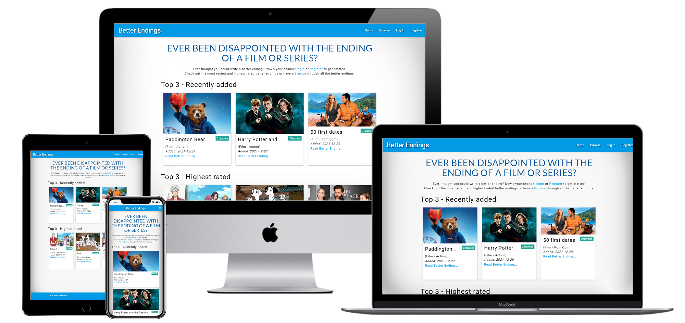
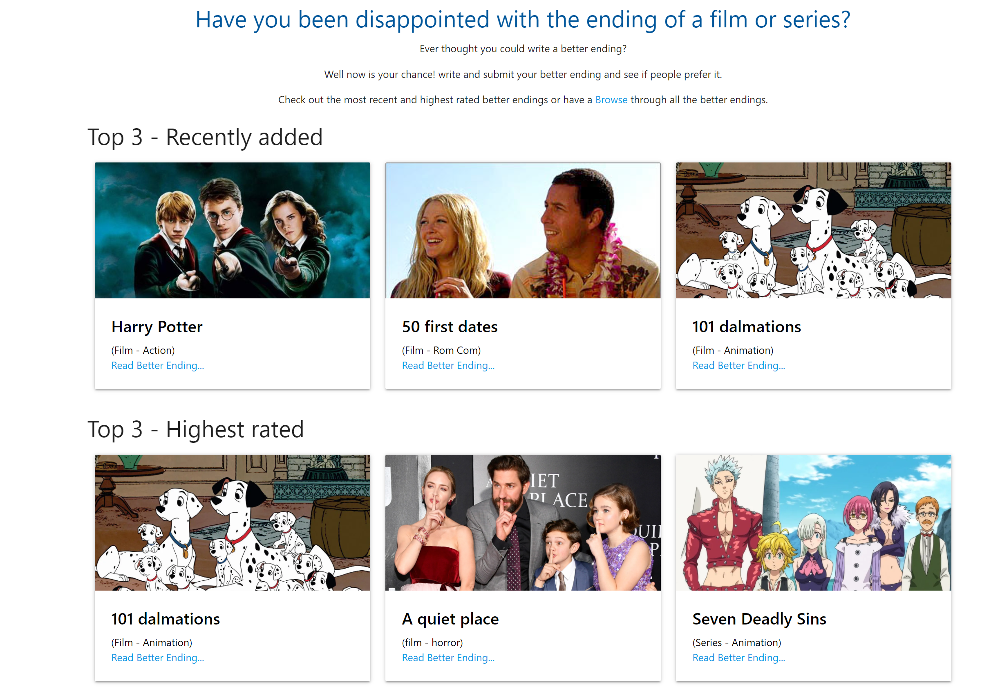
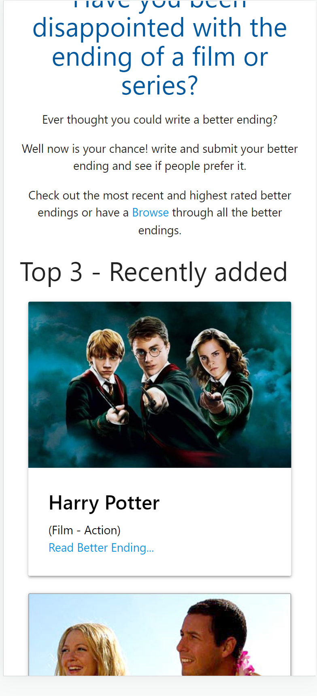

# BETTER ENDINGS

The live link can be found here - [site link](https://milestone-3-project-sam.herokuapp.com/)

This site is targeted at people who have watched filmes or tv series and that have been disappointed with the endings. It offers the opportunity for users to write an alternative ending (a Better Ending). All the Better Endings created can be read and upvoted by users to give the author positive feedback.

## User experience (UX)

### Strategy
* Defining the goals - Due to the global pandemic of Covid, over the last few years the number of new release films and tv series has been significantly reduced. This has lead to an increase in older films and tv series being streamed and re watched. This has brought back reminders of the disappointment some of these exisiting films and tv series brought in regards to the endings. Where a perfectly good or even great film can be overall let down by the ending. With demand for streaming services increased because large parts of Europe have been self-isolating or working from home due to Covid.   
* what is the idea? From this research i narrowed down my idea to having a site that could allow users to write an alternatate ending (a Better Ending) and allow other users to read and upvote, providing positive feedback to the author.
* who is the target audience? My target audience would be all people with an interest in films and tv series. From my reserach this was an ever expanding pool of potential users.
* why should it be created? Offering users the possibility to re write the ending, giving emotional closure to an otherwise frustating or disappointed feelings given from the original ending will make for a more peaceful mindset. It could be seen as a well-being exercise like meditation. 

### Scope
* features and functions - several different ways to view all of the submitted Better Endings (top 3 most recently, top 3 highest rated and a search functionality to search all titles.).
* content requirements - simple but effective. 

#### User stories

#### Admin
* Objective - what does the user want to accomplish? 
    * To manage (create, view, edit and delete) genres. To write, edit and delete all the Better Endings from any user. Also, to view all users Better Endings and to upvote those that they feel are better then the original endings.
* Functional - what does the user need to do to accomplish the objective? whats involved?
    * Admin can log in and have instant access to manage (view, edit and delete) all Better Endings.
    * They can create new Better Endings. 
    * They can also search or browse other authors Better Endings to Upvote them.

#### Author
* Objective - what does the user want to accomplish? 
    * To write, edit and delete all the Better Endings they produced. Also, to view all users Better Endings and to upvote those that they feel are better then the original endings.
* Functional - what does the user need to do to accomplish the objective? whats involved?
    * Authors log in and have instant access to manage (view, edit and delete) their own Better Endings. 
    * They can create new Better Endings.
    * They can also search or browse other authors Better Endings to Upvote them.

#### Logged in user
* Objective - what does the user want to accomplish? 
    * To view all users Better Endings and to upvote those that they feel are better then the original endings.
* Functional (user) - what does the user need to do to accomplish the objective? whats involved?
    * They can create new Better Endings.
    * Users log in and search or browse Better Endings to Upvote them. 

#### Viewer
* Objective - what does the user want to accomplish? 
    * To view all Better Endings.
* Functional - what does the user need to do to accomplish the objective? whats involved?
    * Simply visit the site. No effort involved. Minimal clicks to get to content. 

### Structure
* how will content be organised and presented - site map
    * 3 pages for users - login, register and profile
    * 1 page for admin - manage genres
    * 4 pages for content - home, search, view and edit

### Skeleton

### Surface
* Following the C.R.A.P (consistancy, repetition, alignment and proximity) design methodology the pages will all have the same nav bar, footer and color scheme. This will help create a positive user experience. 

## Design and features

### Home page

* Navigation bar

    * Featured on all pages, the fully responsive bar includes Logo (links to homepage). The links available are then customised depending on which type of user is viewing. If they are not logged in and are just viewing content then the links available are Home, Log in and register. If they are logged in as Admin then the links available are Home, Profile, New Ending, Manage Genres and Log Out. All other logged in users have the following links available; Home, Porfile, New Ending and Log Out.
    * This section will allow the user to easily navigate between pages without having to revert back to the previous page via the browsers back button.
    * The navigation bar uses a collapsed 'hamburger' style for the link on mobile devices and smaller screen sizes. 

* Content

    * The home page begins with a larger header which immediatly gives the context of the site.
    * Further details then provide a link so that a user can browse all the site content.
    * A row of cards display the top 3 - most recently added endings into the database.This is dynamic and will always display the most recent from all the records in the database.
    * A further row of cards display the top 3 - highest rated endings. This is dynamic and will always display the highest rated from all the records in the database. 
    * The header bottom is responsive to screen size and will adjust accordingly by having the cards side by side on a larger screen size. On a smaller screen size the cards will appear below one another.

* Footer

    * The footer section is repeated across all pages for consistancy so the user can become comfortable with the layout no matter which page they are on.

//---------------------------------
## Testing

* [Chrome developer tools](https://developer.chrome.com/docs/devtools/) on the browser was used to see any errors on the pages.
    * Got the error '404 - unable to load favicon.ico'. The pathway on the Base.html template was incorrect. Once the correct pathway link was used this corrected the issue. 
    * Got error 'net::ERR_CONNECTION_RESET'. ??????????????????????????
    * Got error 'Uncaught ReferenceError: $ is not defined'. ?????????????????????

* [Chrome developer tools](https://developer.chrome.com/docs/devtools/) device toggle toolbar was utilised to view the site via emulators of different screen sizes and devices.

* Chrome Lighthouse audit (Chrome -> dev tools -> Lighthouse) was run to for performance, accessibility, SEO and best practices. After running the initial audit the Best Practices category only scored an amber rather then green as the rest of the categories did. The audit advised that the 'Image natural dimensions should be proportional to the display size and the pixel ratio to maximize image clarity'. After ???????????????????????????????????????????? this then resolved the issue 

* JSHint was used to to detect errors and potential problems in your JavaScript code.

* Python -  using [pep8online](http://pep8online.com/) - app.py
    * E501:2:80:line too long (84 > 79 characters). Used brackets and new line with indentation to break up line. This corrected issue.
    * E501:122:80:line too long (81 > 79 characters) . Used brackets and new line with indentation to break up line. This corrected issue.
    * E501:189:80:line too long (83 > 79 characters). Used brackets and new line with indentation to break up line. This corrected issue.
    * E501:194:80:line too long (82 > 79 characters). Used brackets and new line with indentation to break up line. This corrected issue.
    * E501:241:80:line too long (81 > 79 characters). Used brackets and new line with indentation to break up line. This corrected issue.
    * E501:257:80:line too long (84 > 79 characters). Used brackets and new line with indentation to break up line. This corrected issue.
    * After correcting the above errors and pressing the Check again button the following message displayed 'All right'.

### User Acceptance Testing

The UAT was carried out on desktop, tablet and mobile screen sizes. The UAT was also caried out on Chrome, firefox and Edge. This was to ensure cross broswer and cross device compatability and to acieve a positive user experience. 

#### Home page

Test | Expected Outcome | Actual outcome|status
-----|------------------|----------------|--------
Images|All images appear, sized correctly with alt tags|Card images all loaded correctly| Pass
fonts|fonts use specified google fonts| Oswald and Lanto fonts load|Pass
API|Local weather|Weather is displayed for the selected city|Pass
Nav bar|responsive navbar with varying screen sizes| Nav bar is full width with visable logo text and page links on desktop and tablet screen. On mobile screen sizes it is full width with a collapsed 'hamburger' toggle hiding the page links until pressed.|Pass 
links|internal link to remain in current window and external links to open in new tab| National rail did not open in new window which is a fail. 'Map' link opens internal link in same window to map page.|Fail
links - second attempt|After correcting the quote in front of the target attribute in the href the external link should open in a new tab| National rail opened in new window.|Pass
Dynamic links|External links to open in new tab with dynamic city name as url parameter| VistEngland and Airbnb open associated sites in a new tab with the correct url parameter.|Pass
Header bottom|responsive layout| form and city detail text side by side on desktop and tablet screen sizes. City detail text below form on mobile screen sizes.|Pass
interactivity|user action which provides feedback|'choose my destination' button provides a random city name from array and local weather. If a criteria is selected then the array is filtered by type before a random city name is selected and displayed. |Pass

### Validator testing

* HTML using [W3C validator](https://validator.w3.org/nu/?doc=http%3A%2F%2Fmilestone-3-project-sam.herokuapp.com%2F) - home.html

    * 'Error: Element link is missing required attribute href.' - incorrect link used, i must have copy and pasted a link incorrectly from my milestone2 project for bootstrap instead of font awesome. Once the link was corrected the error was resolved.
    * 'Warning: Section lacks heading. Consider using h2-h6 elements to add identifying headings to all sections.' - amended the flash messages to sit inside a div rather then section. this corrected the warning.
    * 'Error: Stray start tag footer.' - the footer was outside of the closing body tag. moved the footer block inside and this corrected the error.
    *Error: An img element must have an alt attribute, except under certain condition - added alt tag to all card templates, this then corrected the error.

    * After correcting the above errors and re running the w3c validator the following message came 'Document checking completed. No errors or warnings to show'.

//----------------------------------------
set up

set up mongodb
randomkeygen for secrete code
create env file
create .gitignore file
create requirements file create procfile
set up heroku - connect via github - add config vars - automatic deployment
install flask pymongo
install dnspython
update requirements file

****** make sure to set debug to false when going live ********

Gitpod codebase change to dependancies
If you have an older version of the template:
run pip3 freeze > unins.txt && pip3 uninstall -y -r unins.txt && rm unins.txt as per @SuzyBee_lead’s instruction above
(re)install all the dependencies that your app needs (using pip3 install)
When you're confident all your dependencies are in the workspace, update requirements using pip3 freeze > requirements.txt
Save, commit, and push.
From here onwards, whenever you (re)start your workspace, you need to do two things:
run pip3 freeze > unins.txt && pip3 uninstall -y -r unins.txt && rm unins.txt first, and then
run  pip3 install -r requirements.txt second

//-----------------------------

GITPOD WORKSPACE ISSUE: FIX :ci:
Due to a recent Gitpod update, many of you experienced problems with your Gitpod workspaces. We’re really sorry for this inconvenience, and our team has been working hard since Friday to correct the issue.
We’ve now completely rebuilt the Gitpod Full Template from scratch, and we’re happy to say that all new workspaces created using the template will now work properly.
If you’ve already created a requirements.txt file or you have tried to deploy your project with the extra, incorrect libraries, then please follow this procedure to recover your workspace:
From the project directory, run this command: curl https://raw.githubusercontent.com/Code-Institute-Org/gitpod-full-template/main/.gitpod.dockerfile > .gitpod.dockerfile  which will overwrite the old Dockerfile with the working one.
Open your corrupted requirements.txt file in Gitpod, select and copy the contents.
Visit https://lechien73.github.io/reqfix/ and paste in the corrupted requirements file. Click Submit
In the results panel, copy the cleaned requirements and paste them into your requirements.txt file back in Gitpod and save.
Add, commit and push everything to your GitHub repository.
Re-create the workspace by clicking on the Gitpod button from your repository.

//------------------
issues

When edit or delete - "TypeError: 'Collection' object is not callable. If you meant to call the 'update' method on a 'Collection' object it is failing because no such method exists." 
got tutor suupor to fix. remove is not a normal Mongo command, delete_one. and mongo.db.genres.update({"_id": ObjectId(genre_id)}, submit) becomes  mongo.db.genres.update_one({"_id": ObjectId(genre_id)}, {"$set": submit})

//--------------------------
top 3 highest rated not working
    ratings = mongo.db.endings.find().sort("ratings", -1).limit(3) should be
        ratings = mongo.db.endings.find().sort("rated", -1).limit(3)

